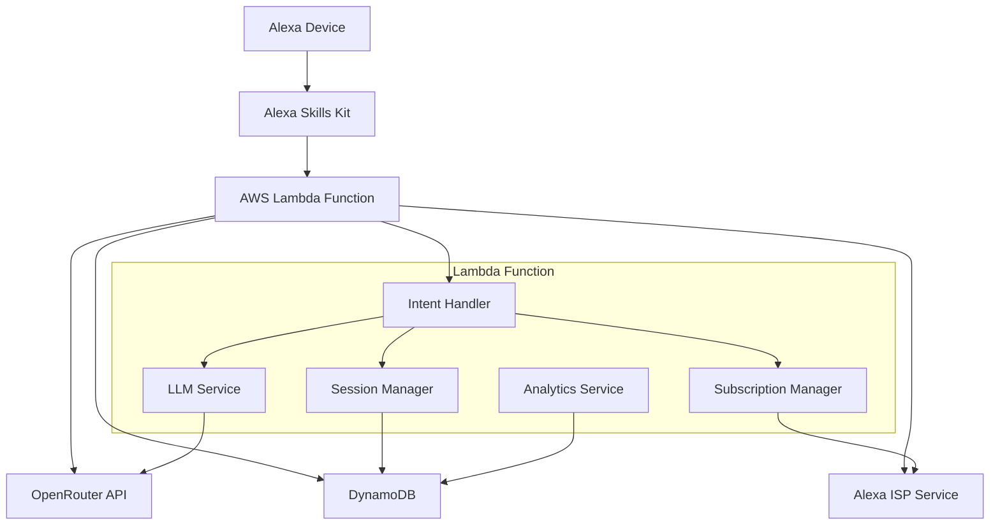

# Design Document

## Overview

このAlexaスキルは、OpenRouter APIを通じてLLMとの音声会話を提供するサービスです。フリーティアとプレミアムサブスクリプションの2層構造で収益化を図り、AWS Lambda上でサーバーレス実行されます。

## Architecture

### High-Level Architecture



### Component Interaction Flow

1. **User Input**: Alexa device captures voice input
2. **Intent Processing**: ASK converts speech to intent and slots
3. **Session Management**: Lambda retrieves/updates conversation context
4. **Subscription Check**: Verify user's subscription status and usage limits
5. **LLM Processing**: Send request to OpenRouter API with context
6. **Response Generation**: Convert LLM response to Alexa-compatible format
7. **Analytics Logging**: Record usage metrics for business intelligence

## Components and Interfaces

### 1. Intent Handler (`IntentHandler`)

**Responsibilities:**
- Route incoming Alexa requests to appropriate handlers
- Validate request format and extract relevant data
- Coordinate response generation

**Key Methods:**
```typescript
interface IntentHandler {
  handleLaunchRequest(request: LaunchRequest): Promise<Response>
  handleChatIntent(request: IntentRequest): Promise<Response>
  handleSubscriptionIntent(request: IntentRequest): Promise<Response>
  handleStopIntent(request: IntentRequest): Promise<Response>
}
```

### 2. Session Manager (`SessionManager`)

**Responsibilities:**
- Maintain conversation context across turns
- Manage session state and user preferences
- Handle context truncation for API limits

**Key Methods:**
```typescript
interface SessionManager {
  getConversationContext(userId: string): Promise<ConversationContext>
  updateConversationContext(userId: string, context: ConversationContext): Promise<void>
  clearConversationContext(userId: string): Promise<void>
  truncateContextIfNeeded(context: ConversationContext): ConversationContext
}
```

### 3. LLM Service (`LLMService`)

**Responsibilities:**
- Interface with OpenRouter API
- Handle API authentication and rate limiting
- Manage different model configurations for free/premium users

**Key Methods:**
```typescript
interface LLMService {
  generateResponse(prompt: string, context: ConversationContext, userTier: UserTier): Promise<string>
  validateApiConfiguration(): Promise<boolean>
  handleApiError(error: ApiError): string
}
```

### 4. Subscription Manager (`SubscriptionManager`)

**Responsibilities:**
- Check user subscription status
- Manage usage limits for free users
- Handle subscription purchase flows

**Key Methods:**
```typescript
interface SubscriptionManager {
  getUserSubscriptionStatus(userId: string): Promise<SubscriptionStatus>
  checkUsageLimits(userId: string): Promise<UsageLimitResult>
  incrementUsageCount(userId: string): Promise<void>
  handlePurchaseRequest(userId: string, productId: string): Promise<PurchaseResult>
}
```

### 5. Analytics Service (`AnalyticsService`)

**Responsibilities:**
- Log user interactions and usage patterns
- Track subscription conversion metrics
- Generate business intelligence data

**Key Methods:**
```typescript
interface AnalyticsService {
  logConversation(userId: string, userTier: UserTier, responseTime: number): Promise<void>
  logSubscriptionEvent(userId: string, event: SubscriptionEvent): Promise<void>
  logError(error: Error, context: ErrorContext): Promise<void>
}
```

## Data Models

### ConversationContext
```typescript
interface ConversationContext {
  userId: string
  sessionId: string
  messages: ChatMessage[]
  createdAt: Date
  lastUpdated: Date
  tokenCount: number
}

interface ChatMessage {
  role: 'user' | 'assistant'
  content: string
  timestamp: Date
}
```

### SubscriptionStatus
```typescript
interface SubscriptionStatus {
  userId: string
  tier: 'free' | 'premium'
  subscriptionId?: string
  expiresAt?: Date
  dailyUsageCount: number
  lastResetDate: Date
}

interface UsageLimitResult {
  canProceed: boolean
  remainingUsage?: number
  limitResetTime?: Date
}
```

### Configuration
```typescript
interface AppConfig {
  openRouterApiKey: string
  openRouterBaseUrl: string
  freeUserDailyLimit: number
  freeUserModel: string
  premiumUserModel: string
  maxContextTokens: number
  responseTimeoutMs: number
}
```

## Error Handling

### Error Categories

1. **API Errors**
   - OpenRouter API unavailable (503)
   - Rate limit exceeded (429)
   - Authentication failure (401)
   - Invalid request format (400)

2. **Subscription Errors**
   - Purchase transaction failed
   - Subscription verification failed
   - Usage limit exceeded

3. **System Errors**
   - DynamoDB connection issues
   - Lambda timeout
   - Memory allocation errors

### Error Response Strategy

```typescript
interface ErrorHandler {
  handleApiError(error: ApiError): AlexaResponse
  handleSubscriptionError(error: SubscriptionError): AlexaResponse
  handleSystemError(error: SystemError): AlexaResponse
}
```

**Error Response Examples:**
- API Unavailable: "I'm having trouble connecting to the AI service right now. Please try again in a few minutes."
- Rate Limited: "You've reached the usage limit. Would you like to hear about our premium subscription for unlimited access?"
- Subscription Failed: "There was an issue with your purchase. Please try again or contact support."

## Testing Strategy

### Unit Testing
- **Intent Handlers**: Mock Alexa requests and verify response format
- **LLM Service**: Mock OpenRouter API responses and test error scenarios
- **Subscription Manager**: Test usage limit logic and purchase flows
- **Session Manager**: Test context management and truncation logic

### Integration Testing
- **End-to-End Conversation Flow**: Test complete user journey from launch to response
- **API Integration**: Test actual OpenRouter API calls with various models
- **DynamoDB Integration**: Test data persistence and retrieval
- **ISP Integration**: Test subscription purchase and verification

### Load Testing
- **Concurrent Users**: Test Lambda scaling under load
- **API Rate Limits**: Verify graceful handling of rate limit scenarios
- **Database Performance**: Test DynamoDB performance under high usage

### User Acceptance Testing
- **Voice Interaction Quality**: Test speech recognition accuracy
- **Response Quality**: Evaluate LLM response appropriateness
- **Subscription Flow**: Test purchase experience on actual Alexa devices
- **Error Scenarios**: Verify user-friendly error messages

### Testing Tools
- **Jest**: Unit and integration testing framework
- **AWS SAM Local**: Local Lambda testing environment
- **Alexa Skills Kit CLI**: Skill testing and deployment
- **Artillery**: Load testing for API endpoints

### Test Data Management
- **Mock Conversations**: Predefined conversation scenarios for testing
- **Test Users**: Separate test user accounts for subscription testing
- **Staging Environment**: Isolated environment for integration testing